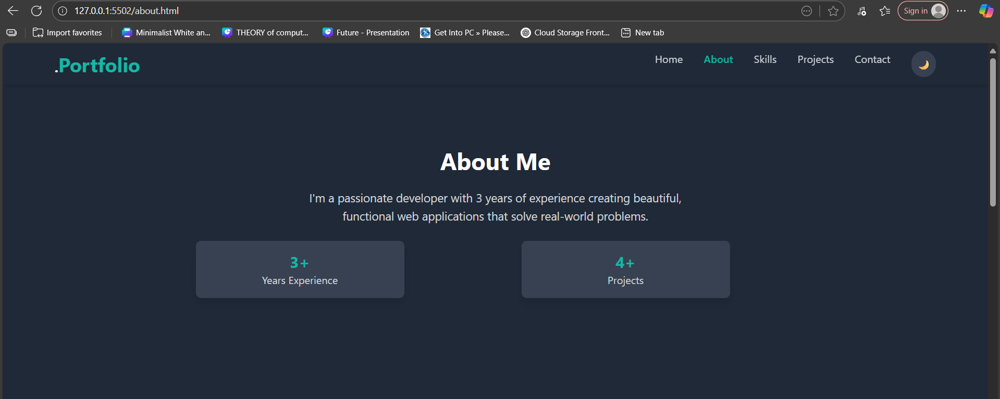
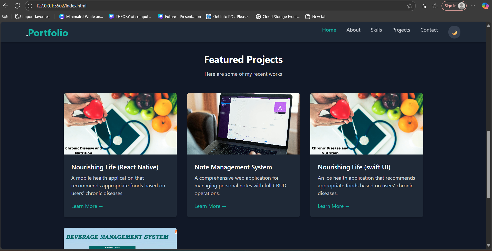
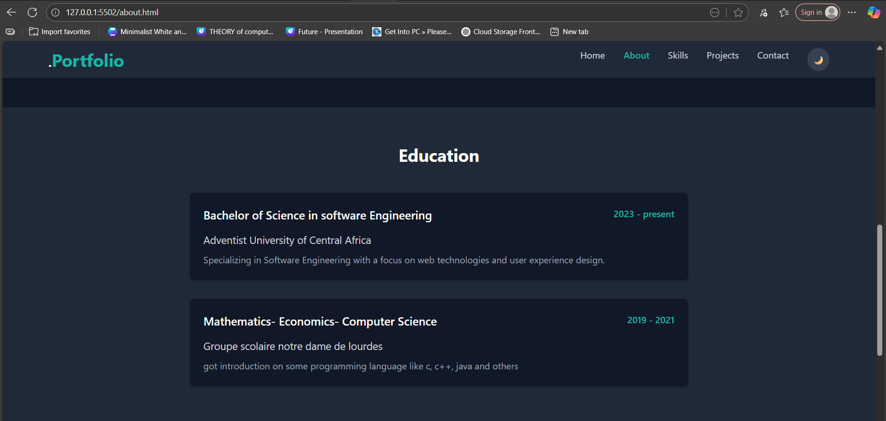
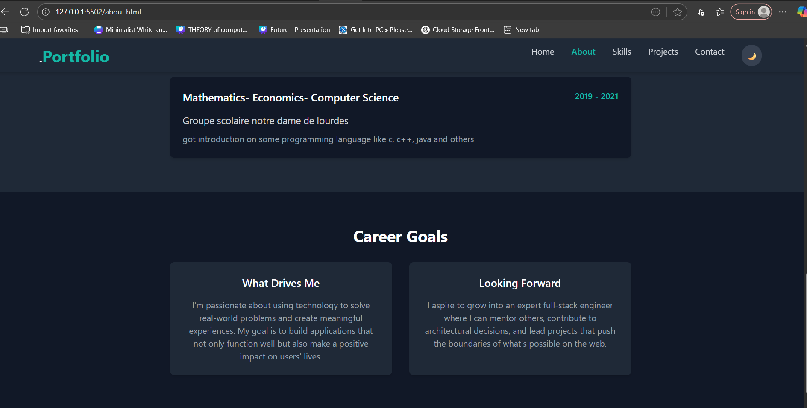
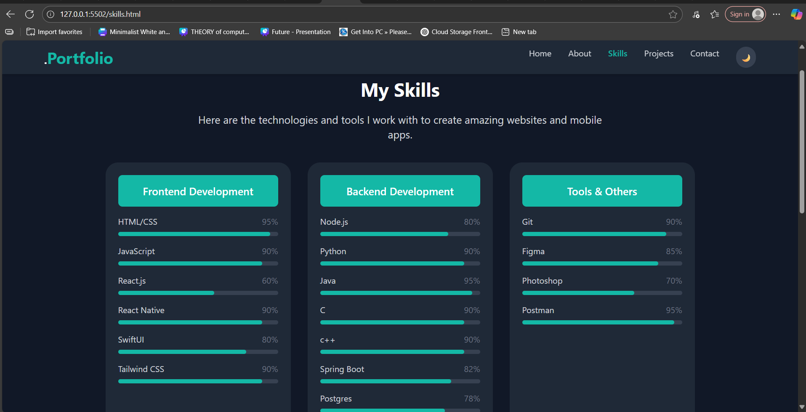
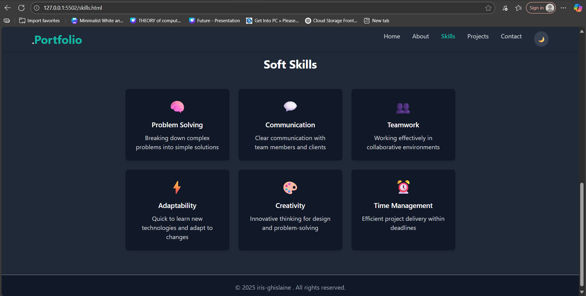
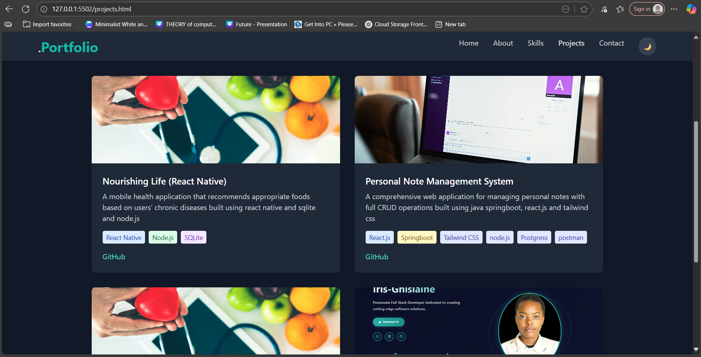
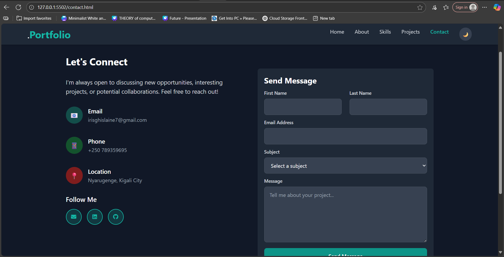

# Personal Portfolio Website

A modern, responsive personal portfolio website built with HTML and Tailwind CSS, showcasing my skills, projects, and professional experience.

##  Features

### Core Pages
- **Home** - Hero section with introduction and featured projects preview
- **About** - Background, education, achievements, and career goals
- **Skills** - Technical skills with progress bars and soft skills
- **Projects** - Portfolio showcase with 4 projects
- **Contact** - Contact form with validation and contact information

### Key Features
- **Responsive Design** - Works perfectly on desktop, tablet, and mobile
- **Dark Mode Toggle** - Switch between light and dark themes
- **Mobile Navigation** - Collapsible hamburger menu for mobile devices
- **Contact Form** - Functional form with JavaScript validation
- **Modern Design** - Clean, professional layout with hover effects
- **Fast Loading** - Optimized for performance

##  Technologies Used

- **HTML5** - Semantic markup structure
- **Tailwind CSS** - Utility-first CSS framework
- **JavaScript** - Interactive functionality
- **Responsive Design** - Mobile, Desktpp and tablet

## Responsive Design

The website is fully responsive and works on:
- **Desktop** - Full layout with sidebar navigation
- **Tablet** - Adapted layout for medium screens
- **Mobile** - Optimized for small screens with hamburger menu

## Key Features

### Dark Mode
- Toggle between light and dark themes
- Preference saved in browser storage
- Smooth color transitions

### Contact Form
- Form validation with JavaScript
- Success message display
- Responsive form layout

### Project Showcase
- 4 sample projects with descriptions
- Technology tags for each project
- Links to GitHub repos

## 🎨 Screenshots

### Home Page
- Hero section with profile photo

- Featured projects preview

### About Page
- Personal background

- Education timeline

- Career goals

### Skills Page
- Technical skills with progress bars

- Soft skills showcase

### Projects Page
- Project grid layout & Technology tags & Project Description

### Contact Page
- Contact form & Contact information & Social media links

Built using HTML, Tailwind CSS, and JavaScript.
